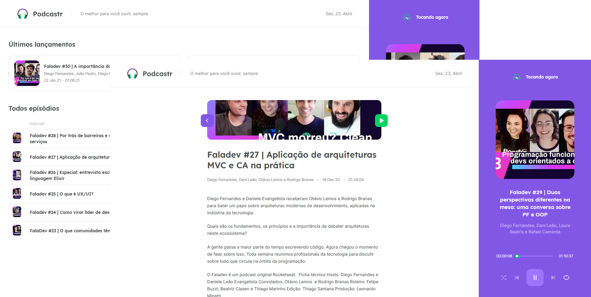

#  Podcastr | seu player favorito de podcast

O Podcastr é uma ferramenta para escutar seu podcast preferido o Fala Dev.

Esse foi projeto foi feito na **Next Level Week #5** um evento gratuído feito pela __Rocktseat__ com objetivo de levar suas habilidades como programador para o Próximo Nível 🚀



## Índice

- ⚙️ [Tecnologias utilizadas](#-tecnologias-utilizadas)
- 💻 [Intruções para rodar](#-tecnologias-utilizadas)

## ⚙️ Tenologías utilizadas

- [Next.js](https://nextjs.org/)
- [React.js](https://pt-br.reactjs.org/)

## 💻 Instruções para rodar 

### Instalar as dependências React & Next 
```
  npm install
  yarn
```
### Build comando
```
  npm run build
  or
  yarn build 
```
### Rodar o build
```
  npm start
  yarn start  #irá subir a aplicação no localhost:3000
```
### Inicar o servidor
```
  npm server
  yarn server
```
